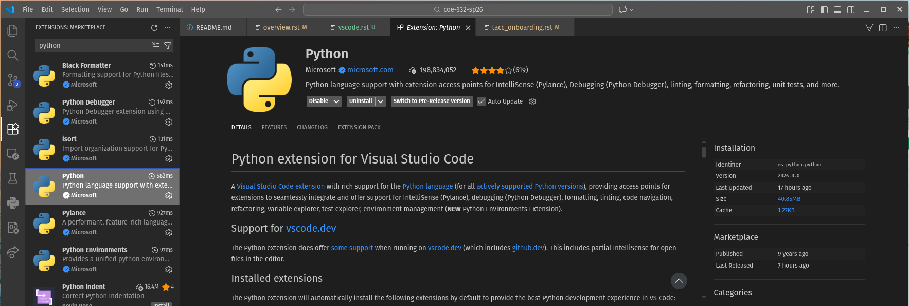
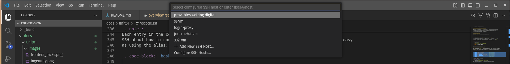

Using Your Class Virtual Machine 
=================================

Every student in the class will have their own virtual machine (VM) to do work. We highly recommend 
that you use your class VM to work on the in-class exercises and take-home projects. The VMs have the Linux OS 
and and some other software installed for you that will make getting started easier. Also, 
we (the teaching staff) have access to all of the VMs and can help you in case something goes very wrong. 

SSH Access To Your VM
----------------------
Once you have provides the instructors with your TACC account and your VM has been created, 
you can use the following steps to ssh to it. For security purposes, the student VMs will be behind a 
firewall and will not be directly accessible to the public internet.

To access your VM via SSH, you will need to first SSH to the login VM. This year, the login VM will be 
located at: **coe332-2026.tacc.cloud**

Steps to SSH to Student VM:

1. First, SSH to the login VM (coe332-2026.tacc.cloud) using your TACC username, password and MFA token. 
2. From ``coe332-2026.tacc.cloud``, type ``ssh coe332-vm``. This should connect you to your personal VM
   as user ``ubuntu``. 

You should see the prompt change in your terminal. The two steps are depicted below:

**Step 1:** SSH from your laptop to student-login:

.. code-block:: console
   :emphasize-lines: 1-3,35,37

   [local]$ ssh username@coe332-2026.tacc.cloud
   (username@coe332-2026.tacc.cloud) Password: 
   (username@coe332-2026.tacc.cloud) TACC_Token: 
    Welcome to Ubuntu 24.04.3 LTS (GNU/Linux 6.8.0-90-generic x86_64)

    * Documentation:  https://help.ubuntu.com
    * Management:     https://landscape.canonical.com
    * Support:        https://ubuntu.com/pro

    System information as of Fri Jan  9 12:07:19 CST 2026

    System load:  0.02               Processes:             140
    Usage of /:   11.4% of 37.70GB   Users logged in:       1
    Memory usage: 9%                 IPv4 address for ens3: 129.114.35.192
    Swap usage:   0%

    Expanded Security Maintenance for Applications is not enabled.

    0 updates can be applied immediately.

    Enable ESM Apps to receive additional future security updates.
    See https://ubuntu.com/esm or run: sudo pro status

    Last login: Thu Jan  8 14:09:53 2026 from 136.62.142.180
    jstubbs@bastion-9:~$
  
| **Step 2:** SSH from coe332-2026.tacc.cloud to your VM: 

.. code-block:: console
   :emphasize-lines: 1,31

   [coe332-2026]$ ssh coe332-vm
   
    Welcome to Ubuntu 24.04.3 LTS (GNU/Linux 6.8.0-90-generic x86_64)

    * Documentation:  https://help.ubuntu.com
    * Management:     https://landscape.canonical.com
    * Support:        https://ubuntu.com/pro

    System information as of Fri Jan  9 18:08:55 UTC 2026

    System load:  0.0                Processes:             183
    Usage of /:   2.5% of 153.94GB   Users logged in:       0
    Memory usage: 1%                 IPv4 address for ens3: 10.10.29.135
    Swap usage:   0%

    * Strictly confined Kubernetes makes edge and IoT secure. Learn how MicroK8s
    just raised the bar for easy, resilient and secure K8s cluster deployment.

    https://ubuntu.com/engage/secure-kubernetes-at-the-edge

    Expanded Security Maintenance for Applications is not enabled.

    3 updates can be applied immediately.
    To see these additional updates run: apt list --upgradable

    Enable ESM Apps to receive additional future security updates.
    See https://ubuntu.com/esm or run: sudo pro status

    Last login: Thu Jan  8 21:28:43 2026 from 10.10.29.250
    ubuntu@student-1:~$ 

Working With VSCode and the VM
------------------------------

We will be writing code in VSCode this semester, a modern Interactive Development 
Environment (IDE) with many advanced features for software engineering such as 
syntax highlighting, code completion and interactive debugging. 
Our setup will involve having VSCode running on your local laptop while all the 
actual code we write and execute will run on your dedicated VM. In this setup, 
you can think of VSCode somewhat like a "web browser" with the actual source code living 
on the VM.

There are a few advantages to this approach, including: 

 1) Your code can be accessed remotely from different computers, and different individuals 
    can access the running code (including the instructors and TAs, who can help troubleshoot issues); 
 2) All students code will execute in the same environment (Linux OS with the same CPU cores and memory, 
    etc.)

Installing VSCode on Your Laptop
--------------------------------
Hopefully everyone had a chance to install VSCode onto their computer last time. If not, here are instructions again,
for Windows, Mac, and Linux:

 * Linux -- Follow the instructions `here. <https://code.visualstudio.com/docs/setup/linux>`_
 * Mac -- Follow the instructions `here. <https://code.visualstudio.com/docs/setup/mac>`_
 * Windows -- Follow the instructions `here. <https://code.visualstudio.com/docs/setup/windows>`_

Remember, you only need to follow the first step to install the actual VSCode application. Next, we're going to 
install the following additional plugins. 

Installing the Necessary VSCode Plugins 
^^^^^^^^^^^^^^^^^^^^^^^^^^^^^^^^^^^^^^^
Open the Extensions view by either clicking Extensions from the left navbar (the icon with two 
squares and a diamond) or by using the Ctrl+Shift+X (Linux/Windows) or Cmd+Shift+X (Mac) key combination. 
You will see the extensions organized into listed of "Installed", "Recommended", etc. You can also 
search for extensions by typing into the search box. Install the following extensions: 

* Python (from Microsoft) -- Core Python development functionality. 
* Pylance (from Microsoft) -- Advanced Python development features (requires the Python extension).
* Black Formatter (from Microsoft) -- Auto-format Python code (also requires the Python extension). 
* Remote-SSH (from Microsoft) -- Provided support for developing code on remote servers using an SSH 
  connection. 

To install a plugin, click the plugin from the Extensions tab and then click "install".

.. warning:: 

    In general, make sure you are installing VSCode extensions from Microsoft or a trusted source. 
    If you search for popular extension names, such as "python", you likely to find multiple 
    extensions.

    Installing the Python extension.

VM Setup: The Python ``uv`` Tool
--------------------------------------------

We'll also be using Python ``uv``, a modern tool for managing local installations of 
Python packages in virtual environments as well as entire python installations 
themselves. We will be combining ``uv`` with Docker later in the semester for highly 
reproducible, portable software distributions. 

Installing Python ``uv``
^^^^^^^^^^^^^^^^^^^^^^^^

To install ``uv`` on your Ubuntu VM, run the following:

.. code-block:: console  

    [coe332-vm]$ curl -LsSf https://astral.sh/uv/install.sh | sh

This one command should be all that is required to get ``uv`` installed. You can test 
the installation with the following command 
(note: you will need to exit the current SSH session and reconnect to get the ``uv`` 
script on your local path; alternatively, you can source our bashrc file): 

.. code-block:: console 

    [coe332-vm]$ uv 

    An extremely fast Python package manager.

    Usage: uv [OPTIONS] <COMMAND>
    . . .

Managing Python Installations with ``uv``
^^^^^^^^^^^^^^^^^^^^^^^^^^^^^^^^^^^^^^^^^

One great thing about ``uv`` is that it can manage multiple Python installations, in addition 
to packages associated with a specific Python project. We can list the specific Python versions 
that ``uv`` finds installed on the local machine and the ones available for download with: 

.. code-block:: console 

    [coe332-vm]$ uv python list
    cpython-3.15.0a3-linux-x86_64-gnu                 <download available>
    cpython-3.15.0a3+freethreaded-linux-x86_64-gnu    <download available>
    cpython-3.14.2-linux-x86_64-gnu                   <download available>
    cpython-3.14.2+freethreaded-linux-x86_64-gnu      <download available>
    cpython-3.13.11-linux-x86_64-gnu                  <download available>
    cpython-3.13.11+freethreaded-linux-x86_64-gnu     <download available>
    cpython-3.12.12-linux-x86_64-gnu                  <download available>
    cpython-3.12.3-linux-x86_64-gnu                   /usr/bin/python3.12
        . . .

To install a specific Python, use: 

.. code-block:: console 

    [coe332-vm]$ uv python install <python_version>

For example, ensure Python 3.14 is installed with the following command:

.. code-block:: console 

    [coe332-vm]$ uv python install 3.14

If all goes well, you should see a message:

.. code-block:: console 

    Installed Python 3.14.2 in 1.48s
      + cpython-3.14.2-linux-x86_64-gnu (python3.14)

We'll be using Python 3.14 throughout the semester. 

Creating Projects with ``uv``
^^^^^^^^^^^^^^^^^^^^^^^^^^^^^^

The ``uv`` tool has the concept of a *project*, which allows you to manage the Python installation (i.e., version) 
together with any packages needed for the code you are writing. Projects are associated with git repositories. In general,
you will want to create a new ``uv`` project for each git repository you work on. 

To create a new project, simply issue: 

.. code-block:: console

    [coe332-vm]$ uv init <project_name>

For example, let's create an in itial ``uv`` project to hold our the work we do in class:

.. code-block:: console

    [coe332-vm]$ uv init class-work

This creates a new directory, ``class-work``, in the current working directory that includes the following 
files: 

* README.md
* main.py
* pyproject.toml

The ``pyproject.toml`` file records specific metadata about the Python version and packages that 
your project depends on. You can think of the ``pyproject.toml`` file as providing a minimum 
specification of the environment required to execute your code correctly. We'll revisit this file 
and the associated ``uv.lock`` file (which gets created later, 
when you add packages to a project) later in the semester. 

A Word on Python Packages
^^^^^^^^^^^^^^^^^^^^^^^^^

The Python programming language includes many modules and packages for common programming 
tasks as part of the **standard library**. These packages come with Python itself --- once you 
have downloaded and installed Python, there is nothing additional you need to do to use the 
package: simply import it into your script and you can being using it. Examples include the 
``json`` library, for working with JSON data (which we will use in the next class), the 
``os`` package, for working with files and directories, and the ``re`` package for leveraging 
regular expressions. 

At the same time, there are many more **third-party** packages that you can install to add 
additional functionality to your programs. For example, the ``requests`` package provides an 
excellent API for making HTTP requests, and the ``fastapi`` package provides a framework for 
developing HTTP services. Unlike packages from the standard library, third-party 
packages must be downloaded and installed before they can be used. 

Many of these packages are managed through the Python 
Pakcage Index, abbreviated PyPI, and pronounced "pi-pi". Packages come in multiple different 
versions and with their own dependencies, so managing the installation of the third-party 
packages a certin program or code base depends on can be a challenging task. 

Adding Dependencies 
^^^^^^^^^^^^^^^^^^^^

You can use the ``uv`` tool to install and manage dependencies for your project. To add a package, 
use the command ``uv add <package_name>``, where ``<package_name>`` is the name of the package as 
it appears on the Python Package Index (PyPI). You can specify a details about the version(s) of the 
package your project can work with -- for example, a minimum and/or maximum version. These details 
get recorded in the ``pyproject.toml`` file when you execute the `` uv add`` command. Additionally, 
``uv`` will actually install a specific version of the package. Details about the specific version 
are recorded in the ``uv.lock`` file, including the sha256 hash of the content of any package 
installed. 

Note that adding a single package may result in downloading multiple packages if the 
package being added has dependencies. In that case, the toml file will include just the package 
specified to the add command, while the lock file will include an entry for every 
package installed. 

Below are some examples of adding packages with ``uv``. Use the examples to add ``fastapi`` 
and ``uvicorn`` to your project. 

.. code-block:: console

    [coe332-vm]$ cd class-work
    
    # add a package
    [coe332-vm]$ uv add fastapi
    
    # or add multiple packages at once
    [coe332-vm]$ uv add uvicorn pydantic

    # check the results
    [coe332-vm]$ cat pyproject.toml
    [project]
    name = "class-work"
    version = "0.1.0"
    description = "Add your description here"
    readme = "README.md"
    requires-python = ">=3.14"
    dependencies = [
        "fastapi>=0.128.0",
        "pydantic>=2.12.5",
        "uvicorn>=0.40.0",
    ]

VSCode IDE via Remote-SSH Plugin 
--------------------------------

Now we will connect to code installed 
on the VM using VSCode and the Remote-SSH plugin.

The easiest way I have found to do this is to 
create an SSH config file with an entry for your VM, 
and then use that alias in VSCode.

For more details and alternatives, see the documentation for Remote SSH [1]. 

1. Install VSCode and SSH client on your machine, if not already installed.

2. Install the Remote-SSH client. Go to Extensions (Ctrl+Shift+X), type "Remote-SSH" and click ``Install``

3. On your local laptop, edit the file ~/.ssh/config to contain the following:

.. code-block:: bash 

    Host 332-vm
        User ubuntu
        HostName 10.10.xx.yy
        IdentityFile ~/.ssh/id_rsa
        ProxyCommand ssh -o 'ForwardAgent yes' coe332-2026.tacc.cloud 'ssh-add && nc %h %p'

Here we have added an entry that will use a proxy command that will first SSH to 
``coe332-2026.tacc.cloud`` before SSHing to the actual student VM. 

.. note:: 

    You need the 10.10.xx.yy IP address for your server in the above (i.e., the values for "xx" and "yy"). 
    You can use the command ``ip addr`` on your student VM to get the
    address. Alternatively, look on the ``coe332-2026`` server for a file ``~/.ssh/config`` which should 
    list your IP there. 

Each entry in the config file instructs 
SSH about how to connect to that host. Once entered, SSH'ing to a host in the config is as easy 
as using the alias:

.. code-block:: bash 

    $ ssh 332-vm

Notes:
  * In the first line, the part after ``Host`` is the alias.
    You can use any name you like, but it should be memorable.
  * The string after ``User`` should be the remote account to connect with.
  * The part after ``HostName`` (i.e., the ``10.10.xx.yy``) should  be the actual IP address of your student server.

4. Now, in a VSCode window, open the Command Pallette (Ctrl+Shift+P) and type 
"remote-ssh: Connect to host", and then:

4a) You should see the alias appear (in my case, I have additional aliases, but the ``332-vm`` is the one we want).
If you do not see it, there is probably an issue with your configs.

    Remote SSH drop down with aliases from the ssh config file

4b) The first time, you will be prompted to select the OS type (choose Linux)

4c) Once you select the OS type, a new VSCode window will open up and connect to the machine. 

.. figure:: ./images/VSCode-remote-ssh-2.png
    :width: 1000px
    :align: center
    :alt: New VSCode window with Remote SSH

    New VSCode window with Remote SSH    

.. note:: 

    If you get a "connection timeout" error, you may need to increase the Remote SSH connection 
    timeout in your VSCode settings. To do that, do the following:
    1. Open the Command Palette in VS Code (Ctrl+Shift+P or Cmd+Shift+P on Mac).
    2. Type and select "Preferences: Open Settings UI".
    3. Search for "Remote.SSH: Connect Timeout".
    4. Change the value from the default 15 to 30 (or higher, like 60).

Choose the ``Open Folder...`` option and select the ``/home/ubuntu`` directory to see the 
complete listing.

.. figure:: ./images/VSCode-remote-ssh-3.png
    :width: 1000px
    :align: center
    :alt: Remote listing of files on the VM

    Remote listing of files on the VM

Configuring a Remote Python Environment
^^^^^^^^^^^^^^^^^^^^^^^^^^^^^^^^^^^^^^^

Finally, we'd like to point our VSCode instance at our ``uv`` environment. For that, 
we first need to install the Python extension on the remote (ssh) host. To do that, 

1. Open the Extensions view in the new window (Ctrl + Shift + X)
2. Search for the Python extension (by Microsoft)
3. Click ``Install in SSH: <host>`` 

With the Python extension installed in the remote, we now need to do the following:

1. Open the Command Palette (Ctrl+Shift+P) and search for Python: Select Interpreter.
2. A list will display the Python environments available on the remote machine 
3. If not displayed, select the ``Enter interpreter path...`` option. 
4. Enter the path to the Python binary in the ``uv`` virtual environment for the project. This 
   should be something like: ``<project_root>/.venv/bin/python3.14``. For example, 
   ``/class-work/.venv/bin/python3.14``

A Simple Test of the Remote Python Setup 
^^^^^^^^^^^^^^^^^^^^^^^^^^^^^^^^^^^^^^^^^

As a simple test of the entire setup, open the ``main.py`` and add the line: 

.. code-block:: python3

    from fastapi import FastAPI

If the remote environment is configured correctly, this should "type check" without any 
import errors since we added ``fastapi`` to the project dependencies in the pyproject.toml. 

Turning on Type Checking 
^^^^^^^^^^^^^^^^^^^^^^^^
To get the most out of VSCode and static analysis, we recommend that you turn on type checking. 
For that, do the following:

1. Open VS Code Settings (File > Preferences > Settings).
2. Search for ``python.analysis.typeCheckingMode`` in the settings search bar.
3. Change the value from off (the default might be basic or off depending on the setup) to ``basic`` or 
   ``strict``.
   a. ``basic`` provides standard checks.
   b. ``strict`` provides more comprehensive checks and is more likely to flag non-existent function imports. 

Test it out by adding a line like the following: 

.. code-block:: python3 

    from fastapi import foobar 

This should highlight ``foobar`` with a red underline indicating that the symbol does not exist within 
the ``fastapi`` package. 