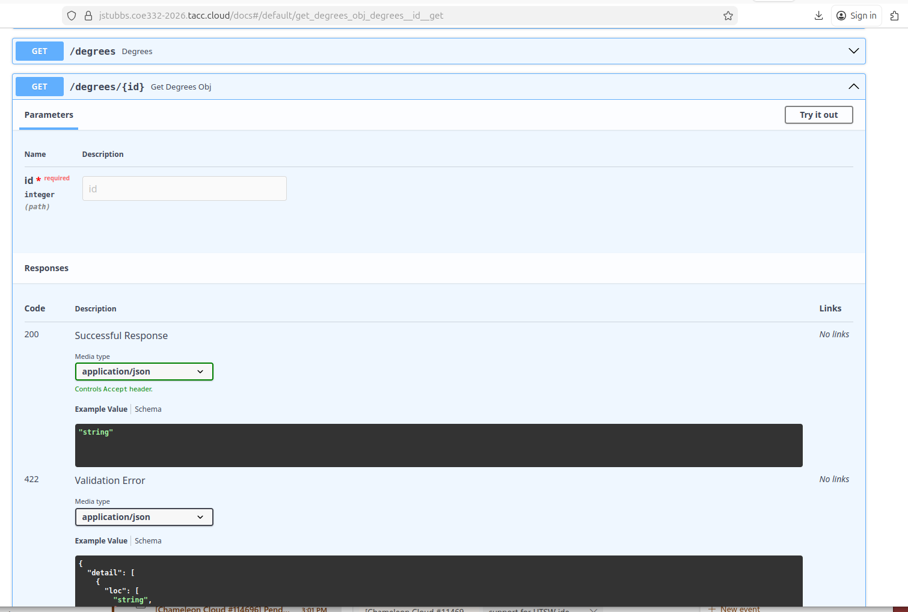

Advanced FastAPI
================

We continue using FastAPI in this module with a look at more complex endpoints and data retrieval
functions for our REST API. After going through this module, students should be able to:

* Identify valid and invalid FastAPI route return types
* Use both Python built-in types (e.g. ``int``) and Pydantic data models to valid FastAPI 
  inputs and return types
* Extract Content-Type and other headers from Flask route responses
* Add query parameters to GET requests, and extract their values inside Flask routes
* Deal with errors from user-supplied input to an API and handle Python exceptions
* Handle multiple request methods to support CRUD operations

.. note::

   We will continue to work on the the individual student VMs. Like last time, it will be helpful for you to
   have two SSH terminals open to your VM at the same time so you can run your Flask application in
   one terminal and test it in the other.

Defining the URLs of Our API
----------------------------

One of our first goals for our API will be to provide an interface to a dataset. Since
the URLs in a REST API are defined by the "nouns" or collections of the
application domain, we can use a noun that represents our data.

For example, suppose we have the following dataset that represents the number of
students earning an undergraduate degree for a given year:

.. code-block:: python3

   def get_data():
       return [ {'id': 0, 'year': 1990, 'degrees': 5818},
                {'id': 1, 'year': 1991, 'degrees': 5725},
                {'id': 2, 'year': 1992, 'degrees': 6005},
                {'id': 3, 'year': 1993, 'degrees': 6123},
                {'id': 4, 'year': 1994, 'degrees': 6096} ]

In this case, one collection described by the data is "degrees". So, let's
define a route, ``/degrees``, that by default returns all of the data points.

EXERCISE 1
~~~~~~~~~~

Create a new file, ``degrees_api.py`` to hold a FastAPI application then do the
following:

1) Import the FastAPI class and instantiate a FastAPI application
   object.
2) Copy the ``get_data()`` method above into the application
   script.
3) Add a route (``/degrees``) which responds to the HTTP ``GET`` request and
   returns the complete list of data returned by ``get_data()``. 

In a separate Terminal use ``curl`` to test out your new route. Does it work as
expected?

.. tip::

   Refer back to the `Intro to FastAPI material <intro_to_fastapi.html>`_ if
   you need help remembering the boiler-plate code.

EXERCISE 2
~~~~~~~~~~
Back inside the ``degrees_api.py`` file, let's add a second route, ``/degrees/{id}`` that returns the 
data associated with a single dictionary. There are often design questions one should consider when writing 
new code. In this case, we have:

  * What method(s) should it accept? 
  * What type will the incoming ``id`` field be from the user? 
  * How will you find the corresponding dictionary? 
  * What should happen if the user enters an ``id`` that doesn't exist?

Discussion
^^^^^^^^^^
By default, FastAPI uses String for the types of path variables. If we use a route declaration like this,

.. code-block:: python3
   
   @app.get('/degrees/{id}')
   def degrees_for_id(id):
       # implementation...

Then any GET request with a URL path that starts with ``/degrees/`` and ends with any string will 
match. That is,

  * ``/degress/0`` --> ``id`` holds the value ``"0"`` as a Python String.
  * ``/degrees/A`` --> ``id`` holds the value ``"A"`` as a Python String.
  * ``/degrees/one`` --> ``id`` holds the value ``"one"`` as a Python String.

will all match the ``degrees_for_id`` route and the variable, ``id`` will hold a ``str`` value. 
In this case, we'll have to deal with the ``str`` type in our function, converting it to ``int``, 
etc.  

Typed URL Parameters
---------------------

We can specify the types of the URL parameters we are expecting using the syntax ``<variable_name:type>``. 
For example, we could change our ``degrees_for_id`` route declaration as follows, to 
indicate we required the ``id`` variable to be an integer:

.. code-block:: python3
   
   @app.get('/degrees/{id}')
   def degrees_for_id(id: int):
       # implementation...

With the above definition, a request like ``GET /degrees/A`` will no longer match our 
``degrees_for_id`` route while a request like ``GET /degrees/2`` will ``call degrees_for_id`` 
with an integer type for the ``id`` variable. 

EXERCISE 3
~~~~~~~~~~
Modify your ``degrees_for_id`` route to specify an integer path parameter. 

Responses in FastAPI
--------------------

Suppose we wanted to add a third route that just returns a single value, the number of degrees 
associated with a particular dictionary. We might proceed as follows:

  * For the URL path, use ``/degrees/{id}/degrees``
  * Iterate through the list looking for the dictionary with the same ``id`` as the input. 
  * If we find a dictionary, ``d``, with the same id, return ``d['degrees']``.

Let's try that and see what happens.

EXERCISE 4
~~~~~~~~~~
Implement a new route for the ``/degrees/{id}/degrees`` endpoint.

EXERCISE 5
~~~~~~~~~~
With your API server running in one window, open a Python interactive
session in another window and:

* Make a ``GET`` request to your ``/degrees`` URL and capture the response in a
  variable, say ``r``
* Verify that ``r.status_code`` is what you expect (what do you expect it to be?)
* Verify that ``r.content`` is what you expect.
* Use ``r.json()`` to decode the response and compare the type to that of ``r.content``.

Then, repeat the above with the ``/degrees/<id>/degrees`` endpoint. 

.. note:: 

   What Python package will you need to import to make the HTTP request? 

HTTP Content Type Headers
-------------------------

Requests and responses have ``headers`` which describe additional metadata about
them. Headers are ``key:value`` pairs (much like dictionary entries). The ``key``
is called the header name and the ``value`` is the header value.

There are many pre-defined headers for common metadata such as specifying the
size of the message (``Content-Length``), the domain the server is listening on
(``Host``), and the type of content included in the message (``Content-Type``).

We can use ``curl`` or the Python ``requests`` library to see all of the headers
returned on a response from our Flask server. Let's try it.

EXERCISE 6
~~~~~~~~~~

1) Use ``curl`` to make a GET request to your ``/degrees`` endpoint
   and pass the ``-v`` (for "verbose") option. This will show you additional information,
   including the headers. Note that with ``-v``, curl shows headers on both the request and
   the response. Request headers are lines that start with a ``>`` while response headers are
   lines that start with a ``<``.
2) Use ``curl`` again to make the same request, but this time pass the ``--head``
   option instead of the ``-v``; this will show you **only** the headers being
   returned in the response.
3) Inside a Python shell, use ``requests`` to make the same GET request to your ``/degrees``
   endpoint, and capture the result in a variable, ``r``. Inspect the ``r.headers`` attribute.
   What is the type of ``r.headers``?

.. code-block:: console

   [coe332-vm]$ url -v 127.0.0.1:8000/degrees
   *   Trying 127.0.0.1:8000...
   * Connected to 127.0.0.1 (127.0.0.1) port 8000
   > GET /degrees HTTP/1.1
   > Host: 127.0.0.1:8000
   > User-Agent: curl/8.5.0
   > Accept: */*
   > 
   < HTTP/1.1 200 OK
   < date: Wed, 11 Feb 2026 22:30:49 GMT
   < server: uvicorn
   < content-length: 181
   < content-type: application/json
   < 
   * Connection #0 to host 127.0.0.1 left intact
   [{"id":0,"year":1990,"degrees":5818},
   {"id":1,"year":1991,"degrees":5725},
   {"id":2,"year":1992,"degrees":6005},
   {"id":3,"year":1993,"degrees":6123},
   {"id":4,"year":1994,"degrees":6096}]   

.. code-block:: python3

   >>> import requests
   >>>
   >>> response = requests.get('http://127.0.0.1:5000/degrees')
   >>>
   >>> response.headers
   {'date': 'Wed, 11 Feb 2026 22:32:55 GMT', 
   'server': 'uvicorn', 
   'content-length': '25', 
   'content-type': 'application/json'}

We see that we are sending a ``Content-Type`` of ``'application/json'``, which is what we want. 
That is how the Python requests library is able to provide the ``r.json()`` function to 
automatically convert to a Python list or dictionary. 

Media Type (or Mime Type)
~~~~~~~~~~~~~~~~~~~~~~~~~

The allowed values for the ``Content-Type`` header are the defined
**media types** (formerly, **mime types**). The main thing you want to know
about media types are that they:

* Consist of a type and subtype
* The most common types are application, text, audio, image, and multipart
* The most common values (type and subtype) are application/json,
  application/xml, text/html, audio/mpeg, image/png, and multipart/form-data

Query Parameters
----------------

The HTTP specification allows for parameters to be added to the URL in form of
``key=value`` pairs. Query parameters come after a ``?`` character and are
separated by ``&`` characters; for example, the following request to a hypothetical API:

.. code-block:: console

      GET https://api.example.com/degrees?limit=3&offset=2

passes two query parameters: ``limit=3`` and ``offset=2``. Note that the URL path in
the example above is still ``/degrees``; that is, the ``?`` character terminates the URL
path, and any characters that follow create the query parameter set for the request.

In REST architectures, query parameters are often used to allow clients to
provide additional, optional arguments to the request.

Common uses of query parameters in RESTful APIs include:

* Pagination: specifying a specific page of results from a collection
* Search terms: filtering the objects within a collection by additional search
  attributes
* Other parameters that might apply to most if not all collections such as an
  ordering attribute (``ascending`` vs ``descending``)

Specifying Query Parameters in FastAPI
~~~~~~~~~~~~~~~~~~~~~~~~~~~~~~~~~~~~~~
FastAPI allows you to specify query parameters directly in a function signature that 
has been decorated with a ``@app`` decorator. When you declare other function parameters that are 
not part of the path parameters, they are automatically interpreted as "query" parameters.

For example, consider the following line of Python code: 

.. code-block:: python3
  
  @app.get('/degrees')
  def get_degrees(limit: int):
     #...function implementation...

We are declaring a variable, ``limit``, in the function signature, but it does not appear in the 
path ``/degrees`` being passed to the ``@app`` decorator. Thus, FastAPI will consider it to be 
a query parameter. 

Note that, just like any other argument to a Python function, if a default value is not specified 
in the signature, then the parameter is assumed to be required. We can modify the signature to 
include a default value -- the syntax is exactly the same as with normal functions, e.g., 

.. code-block:: python3
  
  @app.get('/degrees')
  def get_degrees(limit: int = 10):
     #...function implementation...

With the above signature, the ``limit`` query parameter will not be required, and if not passed, 
will have a default value of 10. 

EXERCISE 7
~~~~~~~~~~
Implement a ``start`` query parameter on your ``GET /degrees`` endpoint so that the API only 
returns degrees on or after the year passed in ``start``. The ``start`` parameter should be 
optional, and, it not passed, the API should return the degrees from the very beginning. 

Check the behavior by issuing some ``curl`` requests in another window, e.g.,  

.. code-block:: console

   [coe332-vm]$ curl http://api.example.com/degrees?start=1993

Let's use this idea to update our ``degrees_api`` to only return the years starting from the
``start`` query parameter year, if that parameter is provided.

Solution
~~~~~~~~~

To implement a ``start`` query parameter on the ``GET /degrees`` endpoint that only returns data
for years on or after the ``start`` year, we first might write someting like:

.. code-block:: python3
   :linenos:

   @app.get('/degrees')
   def degrees(start: int = 1990):
       data = get_data()
       result = [] 
       # iterate through data and check if years are >= start...

Here, we are specifying a default value of ``1990`` which happens to be the first year in the 
datset. Is that a safe approach? Is there a better default value we could use? 

In the following solution, we modify the default value to be 0. That way, even if the dataset 
grows to include more years in the past, the default behavior will still be to return all of the 
data. 

.. code-block:: python3
   :linenos:

   @app.get('/degrees')
   def degrees(start: int = 0):
       data = get_data()
       result = []
       for d in data:
           if d['year'] >= start:
               result.append(d)
       return result

Error Handling
--------------
What happens if the user enters a non-numeric value for the ``start`` parameter? 
Try it and see what happens:

.. code-block:: console

   [coe332-vm]$ curl http://127.0.0.1:8000/degrees?start=abc

Nice! We get a well-formatted JSON object with a fairly descriptive message about what was wrong: 

.. code-block:: console 
   {
   "detail": [
      {
         "type": "int_parsing",
         "loc": [
         "query",
         "start"
         ],
         "msg": "Input should be a valid integer, unable to parse string as an integer",
         "input": "abc"
      }
   ]
   }

This message is saying the input, ``abc``, of the ``start`` query parameter should have been an 
integer. In other words, FastAPI is automatically taking care of error handling for us! This is 
one of the biggest benefits to using strong typing in our Python signatures. Much of the error 
handling, type conversion, etc., can be handled automatically by the underlying library. 

We can also inspect the headers that FastAPI set for us. We set ``-v`` on our ``curl`` command 
to see those: 

.. code-block:: console
   :linenos:
   :emphasize-lines: 8

   [coe332-vm]$ curl -v http://127.0.0.1:8000/degrees?start=abc

   > GET /degrees?start=ab HTTP/1.1
   > Host: 127.0.0.1:8000
   > User-Agent: curl/8.5.0
   > Accept: */*
   > 
   < HTTP/1.1 422 Unprocessable Content
   < date: Mon, 16 Feb 2026 20:16:53 GMT
   < server: uvicorn
   < content-length: 150
   < content-type: application/json

Indeed, we see that our FastAPI server set a return code of 422, Unprocessable Content. This is very 
appropriate, as we know the request was a client error. 

Returning Non-200 Response Codes 
~~~~~~~~~~~~~~~~~~~~~~~~~~~~~~~~
In some cases, the user's request will satisfy our type requirements but it will still be an 
invalid request. For example, let's revisit the ``GET /degrees/{id}`` endpoint. Before, we 
had the following implementation:

.. code-block:: python3 

   @app.get('/degrees/{id}')
   def get_degrees_obj(id):
      data = get_data()
      for d in data: 
         if d['id'] == id:
               return d
      else:
         return {"message": f"Did not find id {id}"}   

But if we inspect the response returned from this enpoint, what status code do we get if 
the ``id`` attribute is an integer but does not correspond to an existing degree? 

As before, we use ``-v`` to see the details:

.. code-block:: console
   :linenos:
   :emphasize-lines: 8

   [coe332-vm]$ curl -v http://127.0.0.1:8000/degrees/45

   > GET /degrees/45 HTTP/1.1
   > Host: 127.0.0.1:8000
   > User-Agent: curl/8.5.0
   > Accept: */*
   > 
   < HTTP/1.1 200 OK
   < date: Mon, 16 Feb 2026 20:24:38 GMT
   < server: uvicorn
   < content-length: 32
   < content-type: application/json

Indeed, the ``45`` passes our type requirements of being an ``int``, but our API doesn't have 
a degree object with id. Should this be a 200 "success" response? 

In this case, the more appropriate reply would be a 404 "not found" resposne code. FastAPI provides 
a facility for specifying non-200 status codes through the ``HTTPException`` class, a 
custom Exception class. If you need to review Python's Exceptions, please see the Unit3 notes on
`Error Handling <../unit03/errorhandling.html>`_.

To use the ``HTTPException`` object, we first need to import it from the ``fastapi`` package: 

.. code-block:: python3 

   from fastapi import HTTPException

Then, as with any other Exception object, we use the ``raise`` keyword. The ``HTTPException`` 
constructor takes two arguments, ``status_code``, which should be an integrer, and ``detail``, 
which should be a message to the client. Here is an updated version of the  ``GET /degrees/{id}`` 
endpoint that returns a 404 when the ``id`` is not found: 

.. code-block:: python3 

   @app.get('/degrees/{id}')
   def get_degrees_obj(id):
      data = get_data()
      for d in data: 
         if d['id'] == id:
               return d
      else:
         raise HTTPException(status_code=404, detail=f"Did not find id {id}")   

EXERCISE 8
~~~~~~~~~~
Update your ``GET /degrees/{id}`` and ``GET /degrees/{id}/degrees`` endpoints to return 404 
response codes when the ``id`` passed does not exist. Use ``curl`` or ``requests`` to confirm 
that your server indeed returns a 404. 

The Power of Types: Automatically Generated API Docs 
-----------------------------------------------------
We already mentioned that providing types on the parameters of our API endpoints allows FastAPI 
to automatically validate HTTP requests, return error codes when user's requests failed to meet 
our type specification, and perform automatic type conversions when the requests were valid. 
In addition to these benefits, another powerful aspect is that FastAPI can automatically generate 
documentation for all of our endpoints based on the types. In fact, FastAPI has already done 
this for our API and made it available via the ``/openapi.json`` endpoint:

.. code-block:: console 

   [coe332-vm]$ curl localhost:8000/openapi.json | jq 

   {
   "openapi": "3.1.0",
   "info": {
      "title": "FastAPI",
      "version": "0.1.0"
   },
   "paths": {
      "/": {
         "get": {
         "summary": "Root",
         "operationId": "root__get",
         "responses": {
            "200": {
               "description": "Successful Response",
               "content": {
               "application/json": {
                  "schema": {}
               }
   . . .

It even serves an interactive application for us on the ``/docs`` URL. We'll do more with that later 
in the semester. 

.. note:: 

   The Linux command-line utility ``jq`` is nice for displaying JSON in pretty-print format. 

We have created a secure proxy to your VM that will allow you to reach port 8000 through your 
web browser. There are two points to keep in mind. 

1. First, when running the FastAPI dev server, we need to specify ``--host 0.0.0.0`` to instruct the 
   server to listen on all interfaces. So, for example, the full command would become: 
   ``fastapi dev --host 0.0.0.0 main.py``. 
2. Second, we need to use the base URL associated with our TACC usernames of the form: 
   ``https://<tacc_username>.coe332-2026.tacc.cloud``. For example, since my TACC username is ``jstubbs``, 
   my base URL would be https://jstubbs.coe332-2026.tacc.cloud.

Then, I can navigate to any URL path that my FasAPI server supports. Try navigating to ``/docs`` to 
see the interactive documentation site that is automatically generated for you by FasAPI based on 
your types. 

Try clicking the "Try it out" buttons to exercise your endpoints! 

CRUD Operations
---------------

To this point, we have looked at only the ``GET`` method. There are three other
methods that are important to learn when working with REST APIs - ``PUT``, ``POST``,
and ``DELETE``. Collectively, these four methods perform **CRUD** operations on our 
data:

* **C**\ reate: ``POST`` - add a new item to a collection
* **R**\ ead: ``GET`` - get an item from a collection
* **U**\ pdate: ``PUT`` - edit an existing item in a collection
* **D**\ elete: ``DELETE`` - delete an item from a collection

To implement one of these methods in a FastAPI route, we use the ``@app`` corresponding to the 
method; e.g., ``@app.post``, ``@app.put``, etc. Then, the function below the decorator must 
contain some logic to act according to the method and request.

The DELETE
~~~~~~~~~~

In some ways, the DELETE is the most straight forward because we (typically) do not require a 
request message. All we need to know to delete the object is the ``id``, which is specified in 
the URL path. What should the delete do? It should remove the corresponding object from the 
Python list. Let's implement that. 

We can delete a key from a dictionary using the ``del <dictionary> <key>`` syntax. That will 
rasie a ``KeyError`` exception if ``<key>`` is not a key in the variable ``<dictionary>``. So, 
we'll need to use a ``try``--``except`` block. Your first attempt might look like this: 

.. code-block:: python3 

   @app.delete('/degrees/{id}')
   def delete_degrees_obj(id: int):
      data = get_data()
      try:
         del data[id] 
         return {"message": f"Item {id} deleted."}
      except KeyError:
         raise HTTPException(status_code=404, detail=f"Did not find id {id}")

This code looks reasonable, but let's test it out to see if it works. Try deleting a key from the 
dictionary using a ``DELETE /degrees/{id}`` request and then try to get it using a 
``GET /degrees/{id}`` request. What do you notice? 

.. note:: 
   You can specify the HTTP verb to send using the ``-X`` flag to ``curl``. For example, 
   ``-X DELETE`` will send a DELETE request. 

The item wasn't deleted! Why is that? It is because the ``get_data`` function returns a hard-coded 
Python list every time it is called. In order to fix this issue, we need to create a global 
Python object that all of our endpoints can reference. 

In order to implement that, we'll first replace ``get_data`` with a globally-defined variable, 
``data``, like so: 

.. code-block:: python3 

   data = [ {'id': 0, 'year': 1990, 'degrees': 5818},
            {'id': 1, 'year': 1991, 'degrees': 5725},
            {'id': 2, 'year': 1992, 'degrees': 6005},
            {'id': 3, 'year': 1993, 'degrees': 6123},
            {'id': 4, 'year': 1994, 'degrees': 6096} ]

Then, in each API route function, we'll replace the call to ``get_data`` with a reference 
to ``global data``. For example, our ``delete_degrees_obj`` function will become: 

.. code-block:: python3 

   @app.delete('/degrees/{id}')
   def delete_degrees_obj(id: int):
      global data
      try:
         del data[id] 
         return {"message": f"Item {id} deleted."}
      except KeyError:
         raise HTTPException(status_code=404, detail=f"Did not find id {id}")

EXERCISE 9
~~~~~~~~~~
Replace the references to ``get_data`` in each of the endpoints: ``GET /degrees``, 
``GET /degrees/{id}``, ``DELETE /degrees/{id}``, and ``GET '/degrees/{id}/degrees'``. 

The POST and PUT -- Modeling Request Messages with Pydantic
~~~~~~~~~~~~~~~~~~~~~~~~~~~~~~~~~~~~~~~~~~~~~~~~~~~~~~~~~~~
In order for the user of our API to describe a new degrees object that they want us to create (the POST method), 
or an update to an existing degrees object (the PUT method), they need to provide us with a detailed description 
of the object. Doing so in URL path or query parameters would be unwieldy, so the HTTP specification allows for 
passing a message in the request body. For our APIs, we'll specify that these request messages should be formatted 
as JSON objects. If the API server successfully processes the request and creates or updates the object, then we'll 
return a response message containing a description of the object we create or update. This will also be a JSON 
object. 

To keep everything strongly typed, we'll use Pydantic to model the request and response messages. FastAPI integrates 
with Pydantic so that we can specify the types of our API endpoints using the models easily. 

To begin, we first need to define our Pydantic models. It is common to define a model to represent the requested 
object and a separate model to represent the object created by the API server and returned in the response. The 
reason is because often times the API server will add or modify fields provided by the request. In our case, each 
degrees object has three fields: 

* ``id``
* ``year``
* ``degrees``

Should the user who is creating a new degrees object pass the ``id``? How would they know what ``id`` value to pass? 
We likely want to keep the ``id`` unique across all degrees objects. How will the user know what the "next" ``id`` should 
be? And even worse, what if two users make requests to create degrees objects at the same time? 

It usually makes more sense for the server to supply the (unique) identifier for a resource because it "knows" all of the 
existing identifiers and can ensure no identifiers are reused. Thus, we'll have two Pydantic models, one with just ``year`` 
and ``degrees``, representing a user request, and a second that adds an ``id`` field, which will be generated by the server. 
Remember that with Pydantic models, like all Python classes, we can use inheritance to avoid having to repeat the duplicate 
fields. 

.. code-block:: python3

   from pydantic import BaseModel

   class DegreesRequest(BaseModel):
      year: int
      degrees: int 

   class DegreesResponse(DegreesRequest):
      id: int 

With our Pydantic models defined, we are ready to create our POST function. This is the function signature we will 
use: 

.. code-block:: python3

   @app.post("/degrees")
   def create_degrees(d: DegreesRequest) -> DegreesResponse:
      # ...implementation...

Here, we are saying a ``DegreesRequest`` object is provided as the POST message body, and a ``DegreesResponse`` object 
is returned. FastAPI automatically takes case of marshaling these objects to and from JSON, and doing validation, etc. 

EXERCISE 10 
~~~~~~~~~~~

Implement the POST function. Your function should do the follow:

1. Get the "next" ``id`` by looking through the existing ``data`` object for the current largest ``id`` value 
   and adding 1 to it. 
2. Create a ``DegreesResponse`` object using the input ``DegreesRequest`` object and the next ``id`` computed in 1). 
3. Add the ``DegreesResponse`` object to the ``data`` object. 
4. Return the ``DegreesResponse`` object to the user. 

SOLUTION 
~~~~~~~~

Here is a complete solution 

.. code-block:: python3

   @app.post("/degrees")
   def create_degrees(d: DegreesRequest) -> DegreesResponse:
      global data 
      # get the next id
      max_id = 0 
      for degrees in data:
         if degrees['id'] > max_id:
               max_id = degrees["id"]
      new_id = max_id + 1 
      new_d = DegreesResponse(year=d.year, degrees=d.degrees, id=new_id)
      data[new_id] = new_d.model_dump()
      return new_d 

Additional Resources
--------------------
